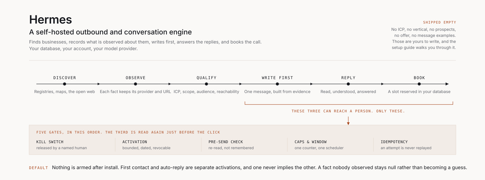

# Hermes

<p align="center">
  
</p>

Hermes is a **self-hosted outbound and conversation engine**. It finds
businesses, records what is actually observed about them, qualifies them against
an ICP you define, writes a first message, reads the replies that come back,
answers them, and — once you have said so, by name — books the call.

It is built around one idea: **nothing is sent until a human says so, by name.**
The resting state is silence. Installing Hermes, connecting an account, starting
the services and importing prospects are, together, still not enough to make it
message anybody.

## This is your instance, and only yours

Hermes is not a service you sign into. You run it, on your machine or your
server, against your own database, your own accounts, your own model provider.

**Never reuse another operator's credentials, cookies, browser profile,
database or prospect data.** They are theirs, the people in them did not consent
to you, and a shared session is how an account gets banned. Every account below
must be one you own or have been given explicit permission to use.

This edition ships with **no ICP, no vertical, no prospects, no offer and no
message examples**. Those are yours to write. There is a guided workflow for it.

## What it does

| | |
|---|---|
| **Discover** | Registries, maps and the open web produce candidates — not yet prospects. |
| **Observe** | Every fact becomes a row with its provider and its source URL. What was not observed stays `null`. |
| **Qualify** | ICP, service scope, audience and reachability. A gate that cannot read a fact refuses, and says which one. |
| **Write first** | One message per prospect, built from what was actually observed about them, checked by code before it can be queued. |
| **Reply** | Inbound messages are collected, understood and answered. One conversational turn costs one model call. |
| **Book** | A slot is proposed, understood in plain language, reserved and confirmed — in your database, with no external calendar. |
| **Operate** | A local web UI (`npm run dev`, port 3230) to read prospects, evidence, conversations and appointments. |

## What it does **not** do by default

Nothing. That is the point, and it is enforced by code rather than by
documentation:

- the **global kill switch is engaged** on a fresh install;
- **no activation row exists**, so neither first contact nor auto-reply has a
  budget to spend;
- **first contact and auto-reply are two separate authorisations.** Arming one
  never arms the other, and receiving a message has never been enough to
  authorise sending one;
- an **activation is bounded** (`--max-effects <n>`), dated and revocable, and
  its frontier is written by the database — arming today does not answer the
  backlog;
- the **pre-send check is re-read immediately before the click**, not at the top
  of the cycle. Re-arming the kill switch while a browser is open stops *that*
  message;
- an **attempted effect is never replayed**, whatever the outcome.

## How safety is handled

Read `SECURITY.md` before sending anything. It is short, and it covers what can
affect other people: what the gates guarantee, what they do **not** cover, and
the legal obligations that are yours and not the software's.

Two properties are worth stating here because they shape everything else:

**Fail-closed is the rule, not a precaution.** A missing, unreadable or
ambiguous fact refuses. An absence of evidence is never evidence of absence.

**What decides is code, and it runs after the model.** Deduplication, scoring
arithmetic, eligibility gates, guardrails: a rule that decides whether a message
leaves without human review cannot depend on a model's mood.

## Running it locally

```bash
git clone <your-copy-of-this-repo> hermes
cd hermes
claude
```

Then tell it:

> Set this project up for me and follow CLAUDE_SETUP.md.

It will audit your machine, install what is genuinely missing, walk you through
the accounts only you can create, help you define your ICP, and stop at every
point that needs a human decision. It ends with a **zero-effect smoke test**:
proof that the engine runs and that nothing left the building.

Doing it by hand is possible — `CLAUDE_SETUP.md` is readable — but it is long,
and the order matters.

**You will need:** Node.js 22+, git, roughly 3 GB of free disk (a browser engine
is downloaded), a PostgreSQL database you control (a file-backed fallback exists
for trying things out), an account for whatever channel you intend to use,
logged in interactively by you, and a model provider you have access to.

None of these are checked at install time by faith: the setup probes each one
and tells you which are actually working.

## The commands you will actually use

```bash
npm run validate              # typecheck + lint + tests
npm run db:migrate            # apply schema migrations
npm run hermes:certify        # is the engine in the state it was certified in?
npm run dev                   # the operator UI, port 3230

npm run campaign:run          # discover, research, score, draft
npm run gate:report           # GO / PARTIAL / FAIL on a batch of prospects
npm run r6b:generate          # build first-touch drafts for a batch

npm run ig:status             # kill switch, queue, caps, window
npm run ig:dry-run            # the whole send path, with the effect removed
npm run autoreply:status      # configured? alive? permitted? waiting?
npm run booking:agenda        # what is proposed, reserved and confirmed
```

### Testing without sending anything

`npm run ig:dry-run` walks the real send path — identity, eligibility, queue,
scheduling, guardrails — and stops before the effect. `npm run conversation:reply`
has three modes that *cannot* produce an effect (shadow, preview, draft) and one
that can (`--live`), which additionally requires the kill switch to be released
by the dedicated gesture, which that command does not know how to perform.

`npm run hermes:certify` answers one question — *is the engine in the state it
was certified in?* — and never *should it send now*, which belongs to the
pre-send check. It imports no provider and no rail.

### Turning first contact on

```bash
npm run ig:kill-switch -- --release --as "Your Name" --reason "..."
npm run ig:autonomous:activation -- --activate --as "Your Name" \
    --reason "..." --max-effects 3
npm run ig:autonomous:worker -- --loop
```

The budget is spent, then the rail stops on its own. `--unbounded` exists and
must be typed deliberately: `--max-effects` and `--unbounded` are exclusive and
one of them is mandatory, so a forgotten option cannot produce an unlimited rail.

### Turning auto-reply on

```bash
npm run autoreply:activation -- --activate --as "Your Name" \
    --reason "..." --max-effects 3
npm run autoreply:worker -- --loop
```

A separate gesture, a separate table, a separate budget. The activation's
frontier is `now()`, written by the database and impossible to backdate: a
message received before you armed it can never trigger an autonomous reply.

### How native booking works

Hermes proposes slots from `config/booking.json`, reads the prospect's answer in
plain language, reserves the slot, and confirms it. There is no Calendly, no
Google Calendar, no CRM calendar, and no link for the prospect to open.

The anti-double-booking guarantee is not application code: it is a PostgreSQL
exclusion constraint over a **generated** time range, so two connections racing
for the same half-hour cannot both win. An ambiguous date does not reserve. A
stale slot is re-checked before the write.

**Set your own availability before enabling it.** `weeklyWindows` has no
default — an instance that has not declared its hours is a configuration error,
never "available at all times".

## Upgrading

```bash
git pull
npm ci
npm run db:migrate
npm run validate
npm run hermes:certify
```

Migrations are additive and checksummed: a migration that has already been
applied is never edited, and `tests/migrationChecksums.test.ts` fails the build
if one is. See `CHANGELOG.md` for what changes between releases, and
`KNOWN_ISSUES.md` for what is known and not yet fixed.

Upgrading from **v1.0.0** applies three migrations (`0060`–`0062`) and requires
no data work. One thing needs a decision: the autonomous policy version changed,
which closes machine approvals granted under the old one. On a fresh instance
that is a no-op; on a running one it means the queue refuses rather than sends,
until the batch is re-approved.

## Licence

See `LICENSE`. This edition is **not** open source and comes with no warranty.
